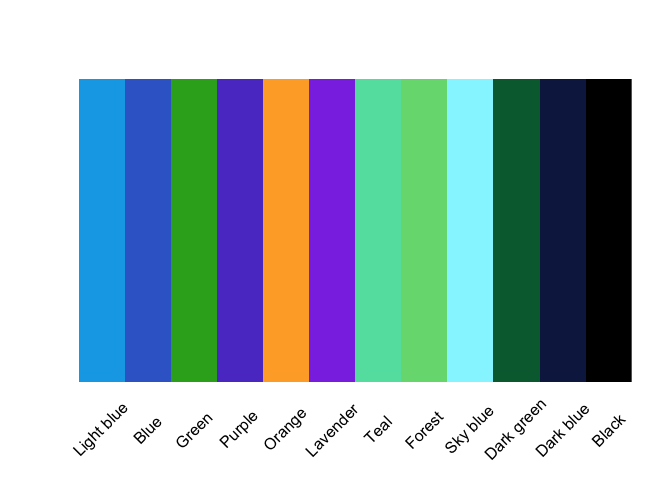

# `OPColors` intro

`OPColors` contains a selection of `ggplot2` color palettes that I like
(or can at least tolerate to some degree)

## Installation

Install `OPColors` from GitHub:

``` r
install.packages("devtools")
devtools::install_github("jaredhuling/OPColors")
```

Access the `OPColors` color palettes with `OPColors()`:

``` r
devtools::install_github("cromer043/OPColors")

library(OPColors)
```

## Display all available palettes

### Discrete palettes

``` r
display_all_OPColors()
```

<!-- -->

# Discrete Color Palettes

## Use with `ggplot2`

Now use `scale_color_OPColors()` with `ggplot2`:

``` r
library(ggplot2)
library(gridExtra)

data(morley)

pltl <- ggplot(data = morley, aes(x = Run, y = Speed,
group = factor(Expt),
colour = factor(Expt))) +
    geom_line(size = 2) +
    theme_bw() +
    theme(panel.background = element_rect(fill = "grey97"),
          panel.border = element_blank(),
          legend.position = "bottom")

pltd <- ggplot(data = morley, aes(x = Run, y = Speed,
group = factor(Expt),
colour = factor(Expt))) +
    geom_line(size = 2) +
    theme_bw() +
    theme(panel.background = element_rect(fill = "grey15"),
          legend.key = element_rect(fill = "grey15"),
          panel.border = element_blank(),
          panel.grid.major = element_line(color = "grey45"),
          panel.grid.minor = element_line(color = "grey25"),
          legend.position = "bottom")

grid.arrange(pltl + scale_color_OPColors(palette = "Default"),
             pltd + scale_color_OPColors(palette = "Primary"), ncol = 2)
```

<!-- -->

``` r
grid.arrange(pltl + scale_color_OPColors(palette = "Brilliant Baby default"),
             pltd + scale_color_OPColors(palette = "Brilliant Baby primary"), ncol = 2)
```

<!-- -->

Color palettes can be displayed using `display_OPColors()`

## default

``` r
display_OPColors("Default")
```

<!-- -->

## Primary

``` r
display_OPColors("Primary")
```

<!-- -->

## Brilliant Baby default

``` r
display_OPColors("Brilliant Baby default")
```

<!-- -->

## Brilliant Baby primary

``` r
display_OPColors("Brilliant Baby primary")
```

<!-- -->

## College Access default

``` r
display_OPColors("College Access default")
```

<!-- -->

## College Access primary

``` r
display_OPColors("College Access primary")
```

<!-- -->

## College Completion default

``` r
display_OPColors("College Completion default")
```

<!-- -->

## College Completion primary

``` r
display_OPColors("College Completion primary")
```

<!-- -->

## Kindergarden to College default

``` r
display_OPColors("K2C default")
```

<!-- -->

## Kindergarden to College primary

``` r
display_OPColors("K2C primary")
```

<!-- -->
